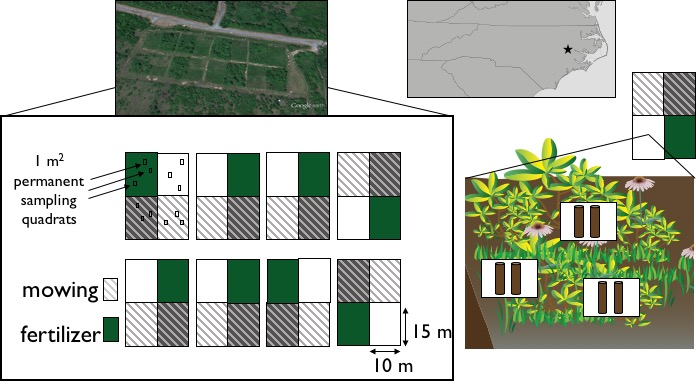

Narrative for the analysis of data from a long-term ecological experiment conducted by Dr. Carol Goodwillie at ECU's West Research Campus. The experiment has monitored the change in plant communities over time. The experimental design is a 2x2 factorial experiment with 2 levels of disturbance (mowed or unmowed) and 2 levels of nutrient addition (fertilized and unfertilized). The experiment was arranged in 8 spatial blocks with each containing the 4 treatment plots. Three fixed quadrats were created within each plot that were sampled annually. The spatial blocks were arranged in two rows that differed in proximity to a ditch which is suspectected to have induced systematic differences in the hydrodynamics among the sets of blocks (see Figure 1). 




```{r load_packages_etc, message=FALSE,include=FALSE, echo=FALSE}
if(Sys.info()[1] == "Darwin"){
  setwd("~/GitHub/WRC_FertMowing/analyses/")
} else {
  setwd(choose.dir())
}
rm(list = ls())

# Code Dependencies
library(MASS)
library(nlme)
library(reshape2)
library(vegan)
library(reshape)
library(lme4)
library(ggplot2)
library(gridExtra)
library(coefplot2)
library(coda)
library(scales)
#install.packages("coefplot2",repos="http://www.math.mcmaster.ca/bolker/R",type="source") 
```

For analysis, percent cover data is combined with stem counts to calculate an importance value.  The importance value provides a metric of ........ which is useful because.......

```{r calc_importance,echo=FALSE, eval=FALSE}
WRC <- read.csv("../data/Plant_WRC.csv")
head(WRC)
str(WRC)
#WRC$SUM<-rowSums(WRC[,-1:-8])

WRC_norm <- WRC
for(i in 1:nrow(WRC)){
  WRC_norm[i,9:89] <- WRC[i,9:89]/sum(WRC[i,9:89])
}
head(WRC_norm)
str(WRC_norm)
which(apply(WRC_norm[,9:89],1,sum,na.rm=T)==0)

cover<-droplevels(subset(WRC_norm,DATA.TYPE=="p cover"))
stem<-droplevels(subset(WRC_norm,DATA.TYPE!="p cover"))
imp_values<-cover[,9:89]+stem[,9:89]
WRC_dat<-data.frame(cover[,1:8],imp_values)
head(WRC_dat)

write.csv(WRC_dat, file="../data/WRC_Importance.csv")
```

Using the importance values we calculate several metrics of diversity, including species richness, Shannon-Weaver, Simpson, and Pielou's evenness.  These diversity metrics calculated for each quadrat will be used to test for treatment effects using GLMMs

```{r diversity_metrics, eval=FALSE}
#Code for calculating diversity metrics for subsequent anlayses - use WRC_Plant_Diversity.csv file
#We had to
plant <- read.csv("../data/WRC_Importance.csv")
head(plant)
str(plant)

#alpha diversity (species number)
alpha <- specnumber(plant[,10:90])
alpha

#Shannon-Weaver (H)
H <- diversity(plant[,10:90], index = "shannon", MARGIN = 1, base = exp(1))
H

#Simpson (D1)
D1 <- diversity(plant[,10:90], index = "simpson", MARGIN = 1, base = exp(1))
D1

#Pielou's evennes (J)
J <- H/log(specnumber(plant[,10:90]))
J

WRC_dat.2 <- data.frame(cover[,1:8],alpha,H,D1,J)
head(WRC_dat.2)
str(WRC_dat.2)
write.csv(WRC_dat.2, file="../data/WRC_Plant_Diversity.csv")
```


Before running statistical analyses, lets take a look at some plots of the data and makesure everything is making sense and to examine for patterns.

```{r first_look, echo=FALSE}
WRC_dat.2 <- read.csv("../data/WRC_Plant_Diversity.csv")
head(WRC_dat.2)

ggplot(WRC_dat.2,aes(x=Year,y=alpha,group=Ditch,colour=factor(Ditch)))+
  stat_summary(fun.data=mean_cl_boot,size=1)+facet_wrap(~Fertilizer*Mowing,labeller = label_both)
```

There appears to be a clear effect of all three factors: fertilizer reduces richness, mowing reduces the effects of fertilizer and proximity to the ditch reduces overall diversity (drying affect?), possibly due to loss of obligate wetland species.

We will use generalized mixed models to analyse these data.  By we will account for the autocorrelation among quadrats within treatment plots and to deal with the "split plot"" nature of the design we will treat block (subplots) nested in Ditch (whole plot) as a random effect and mowing, fertilizer and ditch as a fixed effect. 

The error distribution is a bit tricky for species richness becuase it is by definition a "count" of the number of species and so should be poisson distributed.  However, unlike other count data generated via poisson process, richness data typicallyso are bound at values > 0.  Consequently, these data are often analysed using lognormal errors becuase this bounds the values to be positive.  This later choice is how I will begin.

```{r lognormal_richness}

rm1 <- lmer(log(alpha)~Fertilizer+Mowing+Ditch+Year+
              Fertilizer:Mowing+Fertilizer:Ditch+Fertilizer:Year+
              Mowing:Ditch+Mowing:Year+
              Ditch:Year+
              Fertilizer:Mowing:Ditch+Fertilizer:Mowing:Year+Fertilizer:Ditch:Year+
              Mowing:Ditch:Year+
              Fertilizer:Mowing:Ditch:Year+
              (1|BLOCK/QUADRAT..), data=WRC_dat.2) 
coefplot2(rm1)
```

Several estimates are essentially 0, and this may be a result of the scaling issue suggested in the warning from the model fit.  I will rescale the year data so that they are centered at zero and then try refitting the model.  

```{r rescale}
WRC_dat.2$Year_sc=scale(WRC_dat.2$Year, center = TRUE, scale = TRUE)
rm2 <- lmer(log(alpha)~Fertilizer+Mowing+Ditch+Year_sc+
              Fertilizer:Mowing+Fertilizer:Ditch+Fertilizer:Year_sc+
              Mowing:Ditch+Mowing:Year_sc+
              Ditch:Year_sc+
              Fertilizer:Mowing:Ditch+Fertilizer:Mowing:Year_sc+Fertilizer:Ditch:Year_sc+
              Mowing:Ditch:Year_sc+
              Fertilizer:Mowing:Ditch:Year_sc+
              (1|Ditch/BLOCK), data=WRC_dat.2) 
coefplot2(rm2)
```

Seems like scaling was definitly causing some estimation problems...there are some very interesting patterns here, lets start dropping the most complex terms first, and then simplify sequentially.

```{r richness_inference, echo=FALSE,warnings=FALSE}
rm3 <- lmer(log(alpha)~Fertilizer+Mowing+Ditch+Year_sc+
              Fertilizer:Mowing+Fertilizer:Ditch+Fertilizer:Year_sc+
              Mowing:Ditch+Mowing:Year_sc+
              Ditch:Year_sc+
              Fertilizer:Mowing:Ditch+Fertilizer:Mowing:Year_sc+Fertilizer:Ditch:Year_sc+
              Mowing:Ditch:Year_sc+
              #Fertilizer:Mowing:Ditch:Year_sc+
              (1|Ditch/BLOCK), data=WRC_dat.2) 
anova(rm2,rm3)
```

And it turns out -- just to mkae things really interesting and complicated to interpret -- the 4 way interaction is significant! So, next we will check assumptions of the model fits...
  1. Check for singularity (stdev in summary output)
  2. Check for normally distributed errors (residuals and qqplots)
  3. Check for normality in the conditional modes (box and whiskers)

```{r assumptions, echo=FALSE}
plot(rm2)
qqnorm(resid(rm2,type="deviance"))
#qqline(resid(rm2,type="deviance")) #error here
#conditional modes
augDat <- data.frame(WRC_dat.2,resid=residuals(rm2,type="pearson"),
                     fitted=fitted(rm2))
g1=ggplot(augDat,aes(x=factor(BLOCK),y=resid,colour =Ditch))+geom_boxplot()+coord_flip()
g2=ggplot(augDat,aes(x=factor(Ditch),y=resid))+geom_boxplot()+coord_flip()
grid.arrange(g1,g2,nrow=1)

VarCorr(rm2)
```
I am reasonably happy with the error distribution and witht he conditional modes. We also do not get singularity problems even though we only had 2 levels of ditch which is great!  Now to interpret a 4 way interaction??

Before dealing with the interaction lets look at the parameter estimates and CIs that we will use for inference.  I will generate the CIs using 3 different approaches just for completeness -- Wald Z (which assume quadrative likelihood surfaces and are the least reliable), Profile CIs (which are calculated by profiling the likelihood surface and calculating the CIs directly from it), and Bootstrap (most reliable uses the fitted model structure to bootstrap simulations and calculate CIs). Inferences for the manuscript can be based off of these CIs.

```{r CI_est,echo=FALSE,warning=FALSE,messages=FALSE}
rm2_prof <- confint(rm2)
rm2_quad <- confint(rm2,method="Wald")
#rm2_CI_boot <- confint(rm2,method="boot") 
```

```{r assemble_cmod,echo=FALSE,warning=FALSE,messages=FALSE}
c0 <- setNames(coeftab(rm2)[,c("Estimate","2.5%","97.5%")],
               c("est","lwr","upr"))               
c1 <- rbind(c0,data.frame(est=sqrt(unlist(VarCorr(rm2))),
                       lwr=NA,upr=NA))
c1_prof <- c1[-18,]
c1_prof[,2:3] <- rm2_prof[c(4:19,1),]
c1_boot <- c1[-18,]
#c1_boot[-18,2:3] <- rm2_CI_boot[c(4:19,1),]
ff <- function(x,CI) {
    data.frame(var=rownames(x),x,CI=CI)
}
c2 <- do.call(rbind,mapply(ff,list(c1,c1_prof,c1_boot),
                           list("Wald","profile","boot"),SIMPLIFY=FALSE))
rownames(c2) <- NULL
c2 <- data.frame(c2,fun="lmer")
cmod_Results <- c2
```

```{r plot_Results,echo=FALSE,warning=FALSE}
ggplot(cmod_Results,aes(x=var,y=est,
                        ymin=lwr,ymax=upr,
                        linetype=CI))+
    geom_pointrange(position=position_dodge(width=0.5))+
   scale_y_continuous(lim=c(-.5,.5),expand=c(0,0))+
    coord_flip()+xlab("")+ylab("Estimate of Effect on Richness")+
  scale_colour_brewer(palette="Dark2")+geom_hline(yintercept = 0)
```


Now using the fited model we can generate predicted values and plot richness over time in a 4 panel plot with each panel representing one of the four combinations of mowing and fertilizer and with two point colors reflecting proximity to the ditch.

```{r 4way interaction plot, echo=FALSE,warnings=FALSE,message=FALSE}
pframe=data.frame(expand.grid(Fertilizer=factor(unique(WRC_dat.2$Fertilizer)),
                              Mowing=factor(unique(WRC_dat.2$Mowing)),
                              Year_sc=unique(WRC_dat.2$Year_sc),
                              Ditch=factor(unique(WRC_dat.2$Ditch))))
predframe=predict(rm2,re.form=NA,type="response",newdat=pframe,se.fit=T)
pframe=data.frame(pframe,exp(predframe))

p1=ggplot(pframe,aes(x=Year_sc,y=exp.predframe.,colour=Ditch))+
    geom_smooth()+
  facet_wrap(~Fertilizer*Mowing,labeller = label_both)+
 geom_point(data=WRC_dat.2,aes(x=Year_sc,y=alpha,colour=factor(Ditch)))+
  theme_bw()
  #stat_summary(fun.data=mean_cl_boot,size=1)
  

ditchy=droplevels(subset(WRC_dat.2,Ditch==1))  
noditchy=droplevels(subset(WRC_dat.2,Ditch==0))  
p2=ggplot(data=WRC_dat.2,aes(x=factor(Year),y=(alpha),colour=Ditch))+
  geom_boxplot(data=ditchy,size=1,aes(x=factor(Year),y=(alpha),colour=1))+
    geom_boxplot(data=noditchy,size=1,aes(x=factor(Year),y=(alpha),colour=0))+
facet_wrap(~Fertilizer*Mowing)+theme_bw()

p1
p2
  
```

From Carol "Trying to make sense of the 4-way interaction! Here's what I see: In unmowed plots, fertilizer has had a stronger negative effect on richness in dry than in wet blocks.  But in mowed plots, fertilizer has had a stronger negative effect on richness in wet than in dry blocks.  The latter makes biological sense to me if it has to do with loss of obligate wetland species (which are mostly herbaceous and therefore not an issue any more in the unmowed plots).  The pattern in mowed plots will take some mulling over. "


Okay, so lets test Carols hypothesis by analysing the wetland obligate plants seperately from the generalist and upland species.  If the ditch effect is only a drying affect we should see a significant ditch effect on the wetland plants but no significant effect on the upland plants.

```{r prep_wetland_dat,echo=FALSE,eval=FALSE}
###Ask Carol to update wetland status.csv
wetplant <- read.csv("../data/wetland status.csv")
head(wetplant)
str(wetplant)
obligate_1=which(wetplant[1,]==1)
obligate_2=which(wetplant[1,]==2)
obligate=sort(c(obligate_1))
names(wetplant)
names(plant)
head(plant[,obligate+1])
#alpha diversity (species number)
wet_alpha <- specnumber(plant[,obligate+1])
wet_alpha

#Shannon-Weaver (H)
wet_H <- diversity(plant[,obligate+1], index = "shannon", MARGIN = 1, base = exp(1))
wet_H

#Simpson (D1)
wet_D1 <- diversity(plant[,obligate+1], index = "simpson", MARGIN = 1, base = exp(1))
wet_D1

#Pielou's evennes (J)
wet_J <- wet_H/log(specnumber(plant[,obligate+1]))
wet_J


WRC_wetdat.2 <- data.frame(cover[,1:8],wet_alpha,wet_H,wet_D1,wet_J)
head(WRC_wetdat.2)
str(WRC_wetdat.2)
write.csv(WRC_wetdat.2, file="../data/WRC_wetPlant_Diversity.csv")
```

Now draw a picutre of the wetland plant data.

```{r wetland_plot_boot, echo=FALSE}
#ERROR here when trying to knit to PDF or html b/c of stat_summary
ggplot(WRC_wetdat.2,aes(x=Year,y=wet_alpha,group=Ditch,colour=factor(Ditch)))+
  stat_summary(fun.data=mean_cl_boot,size=1)+
  facet_wrap(~Fertilizer*Mowing,labeller = label_both)

  
```
Key Questions
How does long-term fertilization and mowing influence plant diversity?” 

First we will look at diversity using richness as our measure of diversity...
```{r}
WRC_dat.2$Year_sc=scale(WRC_dat.2$Year, center = TRUE, scale = TRUE)
rm2 <- lmer(log(alpha)~Fertilizer+Mowing+Ditch+Year_sc+
              Fertilizer:Mowing+Fertilizer:Ditch+Fertilizer:Year_sc+
              Mowing:Ditch+Mowing:Year_sc+
              Ditch:Year_sc+
              Fertilizer:Mowing:Ditch+Fertilizer:Mowing:Year_sc+
              Fertilizer:Ditch:Year_sc+
              Mowing:Ditch:Year_sc+
              Fertilizer:Mowing:Ditch:Year_sc+
              (1|Ditch/BLOCK), data=WRC_dat.2) 


rm3 <- lmer(log(alpha)~Fertilizer+Mowing+Ditch+Year_sc+
              Fertilizer:Mowing+Fertilizer:Ditch+Fertilizer:Year_sc+
              Mowing:Ditch+Mowing:Year_sc+
              Ditch:Year_sc+
              Fertilizer:Mowing:Ditch+Fertilizer:Mowing:Year_sc+
              Fertilizer:Ditch:Year_sc+
              Mowing:Ditch:Year_sc+
              #Fertilizer:Mowing:Ditch:Year_sc+
              (1|Ditch/BLOCK), data=WRC_dat.2) 
anova(rm2,rm3)

coefplot2(rm2)
```

Now check assumptions

```{r , echo=FALSE}
plot(rm2)
qqnorm(resid(rm2,type="deviance"))
qqline(resid(rm2,type="deviance"))
#conditional modes
augDat <- data.frame(WRC_dat.2,resid=residuals(rm2,type="pearson"),
                     fitted=fitted(rm2))
g1=ggplot(augDat,aes(x=factor(BLOCK),y=resid,colour =Ditch))+geom_boxplot()+coord_flip()
g2=ggplot(augDat,aes(x=factor(Ditch),y=resid))+geom_boxplot()+coord_flip()
grid.arrange(g1,g2,nrow=1)

VarCorr(rm2)
```
Model generated plot (i.e. plot with random effect variaince included and with boot strap CIs)

```{r , echo=FALSE,warnings=FALSE,message=FALSE}
#ERROR here  Rescale variables?Model is nearly unidentifiable: large eigenvalue ratio
#rm2_CI_boot <- confint(rm2,method="boot")

pframe=data.frame(expand.grid(Fertilizer=factor(unique(WRC_dat.2$Fertilizer)),
                              Mowing=factor(unique(WRC_dat.2$Mowing)),
                              Year_sc=unique(WRC_dat.2$Year_sc),
                              Ditch=factor(unique(WRC_dat.2$Ditch))))
predframe=predict(rm2,re.form=NA,type="response",newdat=pframe,se.fit=T)
pframe=data.frame(pframe,exp(predframe))

p1=ggplot(pframe,aes(x=Year_sc,y=exp.predframe.,colour=Ditch))+
    geom_smooth()+
  facet_wrap(~Fertilizer*Mowing,labeller = label_both)+
 geom_point(data=WRC_dat.2,aes(x=Year_sc,y=alpha,colour=factor(Ditch)))+
  theme_bw()
  #stat_summary(fun.data=mean_cl_boot,size=1)
  

ditchy=droplevels(subset(WRC_dat.2,Ditch==1))  
noditchy=droplevels(subset(WRC_dat.2,Ditch==0))  
p2=ggplot(data=WRC_dat.2,aes(x=factor(Year),y=(alpha),colour=Ditch))+
  geom_boxplot(data=ditchy,size=1,aes(x=factor(Year),y=(alpha),colour=1))+
    geom_boxplot(data=noditchy,size=1,aes(x=factor(Year),y=(alpha),colour=0))+
facet_wrap(~Fertilizer*Mowing)+theme_bw()

p1
p2
  
```

Now we can run the same set of analyses as above but instead focusing on Shannons index of diversity rather than only on species richness.

```{r}
WRC_dat.2$Year_sc=scale(WRC_dat.2$Year, center = TRUE, scale = TRUE)
rm4 <- lmer(H~Fertilizer+Mowing+Ditch+Year_sc+
              Fertilizer:Mowing+Fertilizer:Ditch+Fertilizer:Year_sc+
              Mowing:Ditch+Mowing:Year_sc+
              Ditch:Year_sc+
              Fertilizer:Mowing:Ditch+Fertilizer:Mowing:Year_sc+
              Fertilizer:Ditch:Year_sc+
              Mowing:Ditch:Year_sc+
              Fertilizer:Mowing:Ditch:Year_sc+
              (1|Ditch/BLOCK), data=WRC_dat.2) 


rm5 <- lmer(H~Fertilizer+Mowing+Ditch+Year_sc+
              Fertilizer:Mowing+Fertilizer:Ditch+Fertilizer:Year_sc+
              Mowing:Ditch+Mowing:Year_sc+
              Ditch:Year_sc+
              Fertilizer:Mowing:Ditch+Fertilizer:Mowing:Year_sc+
              Fertilizer:Ditch:Year_sc+
              Mowing:Ditch:Year_sc+
              #Fertilizer:Mowing:Ditch:Year_sc+
              (1|Ditch/BLOCK), data=WRC_dat.2) 
anova(rm4,rm5)
```

Unlike with the case with species richness we no longer have a significant 4 way interaction when focused on Shannons index. So we will drop levels in sequence to test the 3 way interactions.  To do the model selection in a systematic way I am going to drop the 3 way interactions with year from the model first and compare to the model including all 3 way interactions. Then I will drop Mowing and then fertilizer to generate 3 simplified models to compare with the full 3 way interaction model.

```{r}
rm6a <- lmer(H~Fertilizer+Mowing+Ditch+Year_sc+
              Fertilizer:Mowing+Fertilizer:Ditch+Fertilizer:Year_sc+
              Mowing:Ditch+Mowing:Year_sc+Ditch:Year_sc+
              Fertilizer:Mowing:Ditch+
              #Fertilizer:Mowing:Year_sc+
              #Fertilizer:Ditch:Year_sc+
              #Mowing:Ditch:Year_sc+
              #Fertilizer:Mowing:Ditch:Year_sc+
              (1|Ditch/BLOCK), data=WRC_dat.2) 
rm6b <- lmer(H~Fertilizer+Mowing+Ditch+Year_sc+
              Fertilizer:Mowing+Fertilizer:Ditch+Fertilizer:Year_sc+
              Mowing:Ditch+Mowing:Year_sc+Ditch:Year_sc+
              #Fertilizer:Mowing:Ditch+
              #Fertilizer:Mowing:Year_sc+
              Fertilizer:Ditch:Year_sc+
              #Mowing:Ditch:Year_sc+
              #Fertilizer:Mowing:Ditch:Year_sc+
              (1|Ditch/BLOCK), data=WRC_dat.2) 
rm6c <- lmer(H~Fertilizer+Mowing+Ditch+Year_sc+
              Fertilizer:Mowing+Fertilizer:Ditch+Fertilizer:Year_sc+
              Mowing:Ditch+Mowing:Year_sc+Ditch:Year_sc+
              #Fertilizer:Mowing:Ditch+
              #Fertilizer:Mowing:Year_sc+
              #Fertilizer:Ditch:Year_sc+
              Mowing:Ditch:Year_sc+
              #Fertilizer:Mowing:Ditch:Year_sc+
              (1|Ditch/BLOCK), data=WRC_dat.2) 
rm6d <- lmer(H~Fertilizer+Mowing+Ditch+Year_sc+
              Fertilizer:Mowing+Fertilizer:Ditch+Fertilizer:Year_sc+
              Mowing:Ditch+Mowing:Year_sc+Ditch:Year_sc+
              #Fertilizer:Mowing:Ditch+
              #Fertilizer:Mowing:Year_sc+
              #Fertilizer:Ditch:Year_sc+
              #Mowing:Ditch:Year_sc+
              #Fertilizer:Mowing:Ditch:Year_sc+
              (1|Ditch/BLOCK), data=WRC_dat.2) 
anova(rm5,rm6a)
anova(rm5,rm6b)
anova(rm5,rm6c)

```

Excluding year from the 3 way interaction did not sifnificantly reduce the explanatory power of the model while removing 3 way interaction invluding the other terms did, thus I will retain the model with the 3 way interaction of Fertilizer, Ditch proximity and Mowing and compare it to a model that excludes all 3 way itneractions.

```{r}
rm7 <- lmer(H~Fertilizer+Mowing+Ditch+Year_sc+
              Fertilizer:Mowing+Fertilizer:Ditch+Fertilizer:Year_sc+
              Mowing:Ditch+Mowing:Year_sc+Ditch:Year_sc+
              #Fertilizer:Mowing:Ditch+
              #Fertilizer:Mowing:Year_sc+
              #Fertilizer:Ditch:Year_sc+
              #Mowing:Ditch:Year_sc+
              #Fertilizer:Mowing:Ditch:Year_sc+
              (1|Ditch/BLOCK), data=WRC_dat.2) 
anova(rm6a,rm7)

```
So from this stepwise approach it looks like we have identified the simplest best model.  Now ew can do some diagnostics on it. 

```{r , echo=FALSE}
plot(rm6a)
qqnorm(resid(rm6a,type="deviance"))
qqline(resid(rm6a,type="deviance"))
#conditional modes
augDat <- data.frame(WRC_dat.2,resid=residuals(rm6a,type="pearson"),
                     fitted=fitted(rm2))
g1=ggplot(augDat,aes(x=factor(BLOCK),y=resid,colour =Ditch))+geom_boxplot()+coord_flip()
g2=ggplot(augDat,aes(x=factor(Ditch),y=resid))+geom_boxplot()+coord_flip()
grid.arrange(g1,g2,nrow=1)

VarCorr(rm6a)
```
Model generated plot (i.e. plot with random effect variaince included and with boot strap CIs)

```{r 3way interaction plot, echo=FALSE,warnings=FALSE,message=FALSE}
#ERROR "Rescale variables?Model is nearly unidentifiable: large eigenvalue ratio..."
#rm6a_CI_boot <- confint(rm6a,method="boot")

pframe=data.frame(expand.grid(Fertilizer=factor(unique(WRC_dat.2$Fertilizer)),
                              Mowing=factor(unique(WRC_dat.2$Mowing)),
                              Year_sc=unique(WRC_dat.2$Year_sc),
                              Ditch=factor(unique(WRC_dat.2$Ditch))))
predframe=predict(rm6a,re.form=NA,type="response",newdat=pframe,se.fit=T)
pframe=data.frame(pframe,(predframe))

p1=ggplot(pframe,aes(x=Year_sc,y=X.predframe.,colour=Ditch))+
    geom_smooth()+
  facet_wrap(~Fertilizer*Mowing,labeller = label_both)+
 geom_point(data=WRC_dat.2,aes(x=Year_sc,y=H,colour=factor(Ditch)))+
  theme_bw()
  #stat_summary(fun.data=mean_cl_boot,size=1)
  

ditchy=droplevels(subset(WRC_dat.2,Ditch==1))  
noditchy=droplevels(subset(WRC_dat.2,Ditch==0))  
p2=ggplot(data=WRC_dat.2,aes(x=factor(Year),y=(H),colour=Ditch))+
  geom_boxplot(data=ditchy,size=1,aes(x=factor(Year),y=(H),colour=1))+
    geom_boxplot(data=noditchy,size=1,aes(x=factor(Year),y=(H),colour=0))+
facet_wrap(~Fertilizer*Mowing)+theme_bw()

p1
p2
  
```


Question 2:  How have obligate wetland species changed over time in response to mowing/fert?

```{r ,echo=FALSE,eval=FALSE}
wetplant <- read.csv("../data/wetland status.csv")
head(wetplant)
str(wetplant)
obligate_1=which(wetplant[1,]==1)
obligate_2=which(wetplant[1,]==2)
obligate=sort(c(obligate_1))
names(wetplant)
names(plant)
head(plant[,obligate+1])
#alpha diversity (species number)
wet_alpha <- specnumber(plant[,obligate+1])
wet_alpha

#Shannon-Weaver (H)
wet_H <- diversity(plant[,obligate+1], index = "shannon", MARGIN = 1, base = exp(1))
wet_H

#Simpson (D1)
wet_D1 <- diversity(plant[,obligate+1], index = "simpson", MARGIN = 1, base = exp(1))
wet_D1

#Pielou's evennes (J)
wet_J <- wet_H/log(specnumber(plant[,obligate+1]))
wet_J


WRC_wetdat.2 <- data.frame(cover[,1:8],wet_alpha,wet_H,wet_D1,wet_J)
head(WRC_wetdat.2)
str(WRC_wetdat.2)
write.csv(WRC_wetdat.2, file="../data/WRC_wetPlant_Diversity.csv")
```

Now draw a picutre of the wetland plant data.

```{r , echo=FALSE}
ggplot(WRC_wetdat.2,aes(x=Year,y=wet_alpha,group=Ditch,colour=factor(Ditch)))+
  stat_summary(fun.data=mean_cl_boot,size=1)+facet_wrap(~Fertilizer*Mowing,labeller = label_both)
```

First we will look at diversity using richness as our measure of diversity...
```{r}
WRC_wetdat.2$Year_sc=scale(WRC_wetdat.2$Year, center = TRUE, scale = TRUE)
wm1 <- glmer((wet_alpha)~Fertilizer+Mowing+Ditch+Year_sc+
              Fertilizer:Mowing+Fertilizer:Ditch+Fertilizer:Year_sc+
              Mowing:Ditch+Mowing:Year_sc+
              Ditch:Year_sc+
              Fertilizer:Mowing:Ditch+Fertilizer:Mowing:Year_sc+
              Fertilizer:Ditch:Year_sc+
              Mowing:Ditch:Year_sc+
              Fertilizer:Mowing:Ditch:Year_sc+
              (1|Ditch/BLOCK), data=WRC_wetdat.2,family="poisson") 


wm2 <- glmer((wet_alpha)~Fertilizer+Mowing+Ditch+Year_sc+
              Fertilizer:Mowing+Fertilizer:Ditch+Fertilizer:Year_sc+
              Mowing:Ditch+Mowing:Year_sc+
              Ditch:Year_sc+
              Fertilizer:Mowing:Ditch+Fertilizer:Mowing:Year_sc+
              Fertilizer:Ditch:Year_sc+
              Mowing:Ditch:Year_sc+
              #Fertilizer:Mowing:Ditch:Year_sc+
              (1|Ditch/BLOCK), data=WRC_wetdat.2,family="poisson") 
anova(wm1,wm2)

coefplot2(wm1)
overdisp_fun <- function(model) {
  ## number of variance parameters in 
  ##   an n-by-n variance-covariance matrix
  vpars <- function(m) {
    nrow(m)*(nrow(m)+1)/2
  }
  model.df <- sum(sapply(VarCorr(model),vpars))+length(fixef(model))
  rdf <- nrow(model.frame(model))-model.df
  rp <- residuals(model,type="pearson")
  Pearson.chisq <- sum(rp^2)
  prat <- Pearson.chisq/rdf
  pval <- pchisq(Pearson.chisq, df=rdf, lower.tail=FALSE)
  c(chisq=Pearson.chisq,ratio=prat,rdf=rdf,p=pval)
}
overdisp_fun(wm1)

```

As with the overall plant data set there is again a signifcnat 4 way interaction for wetland obligate plants.

Now check assumptions

```{r, echo=FALSE}
plot(wm1)
qqnorm(resid(wm1,type="deviance"))
qqline(resid(wm1,type="deviance"))
#conditional modes
augDat <- data.frame(WRC_wetdat.2,resid=residuals(rm2,type="pearson"),
                     fitted=fitted(rm2))
g1=ggplot(augDat,aes(x=factor(BLOCK),y=resid,colour =Ditch))+geom_boxplot()+coord_flip()
g2=ggplot(augDat,aes(x=factor(Ditch),y=resid))+geom_boxplot()+coord_flip()
grid.arrange(g1,g2,nrow=1)

VarCorr(wm1)
summary(wm1)
relgrad <- with(wm1@optinfo$derivs,solve(Hessian,gradient))
max(abs(relgrad))##okay to ignore the warning in the summary output...this suggest convergence!
```
Model generated plot (i.e. plot with random effect variaince included and with boot strap CIs)

```{r, echo=FALSE,warnings=FALSE,message=FALSE}
#wm1_CI_boot <- confint(wm1,method="boot")

pframe=data.frame(expand.grid(Fertilizer=factor(unique(WRC_wetdat.2$Fertilizer)),
                              Mowing=factor(unique(WRC_wetdat.2$Mowing)),
                              Year_sc=unique(WRC_wetdat.2$Year_sc),
                              Ditch=factor(unique(WRC_wetdat.2$Ditch))))
predframe=predict(wm1,re.form=NA,type="response",newdat=pframe,se.fit=T)
pframe=data.frame(pframe,(predframe))

p1=ggplot(pframe,aes(x=Year_sc,y=X.predframe.,colour=Ditch))+
    geom_smooth()+
  facet_wrap(~Fertilizer*Mowing,labeller = label_both)+
 geom_point(data=WRC_wetdat.2,aes(x=Year_sc,y=wet_alpha,colour=factor(Ditch)))+
  theme_bw()
  #stat_summary(fun.data=mean_cl_boot,size=1)
  

ditchy=droplevels(subset(WRC_wetdat.2,Ditch==1))  
noditchy=droplevels(subset(WRC_wetdat.2,Ditch==0))  
p2=ggplot(data=WRC_wetdat.2,aes(x=factor(Year),y=(wet_alpha),colour=Ditch))+
  geom_boxplot(data=ditchy,size=1,aes(x=factor(Year),y=(wet_alpha),colour=1))+
    geom_boxplot(data=noditchy,size=1,aes(x=factor(Year),y=(wet_alpha),colour=0))+
facet_wrap(~Fertilizer*Mowing)+theme_bw()

p1
p2
```

